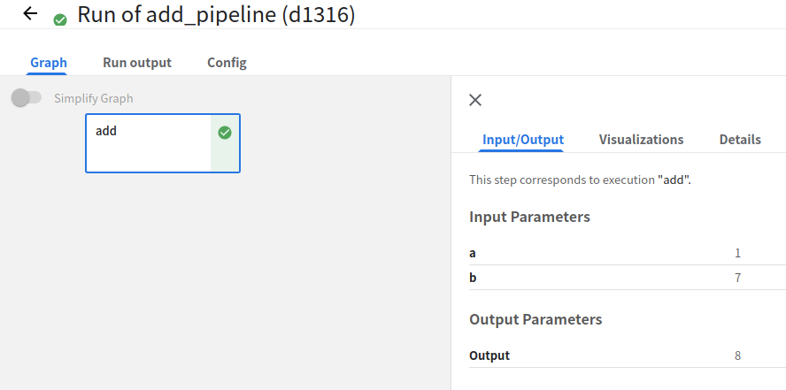
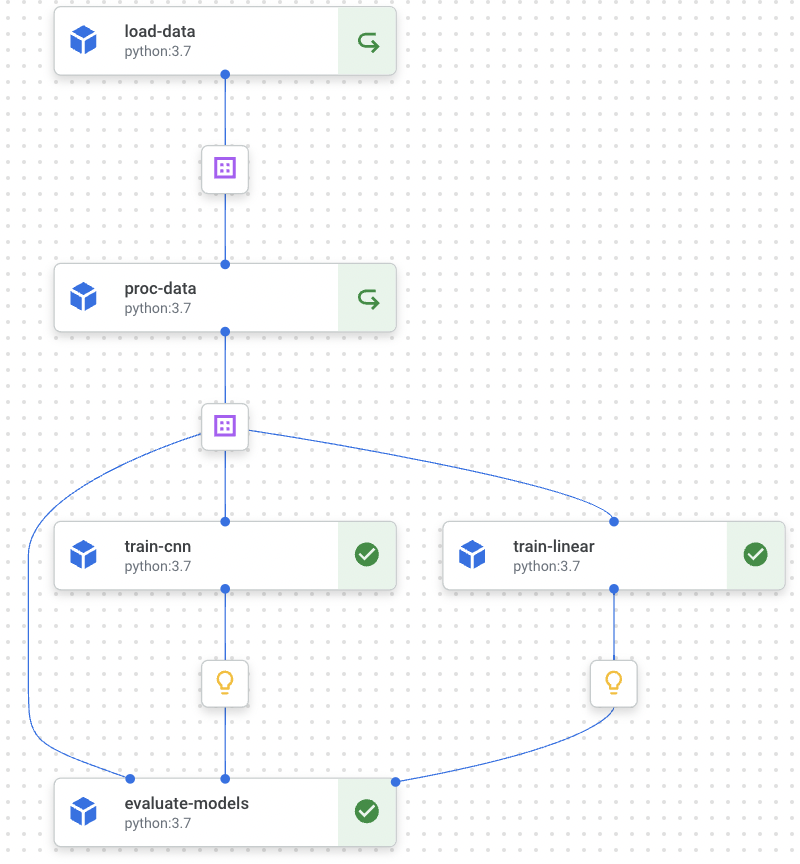
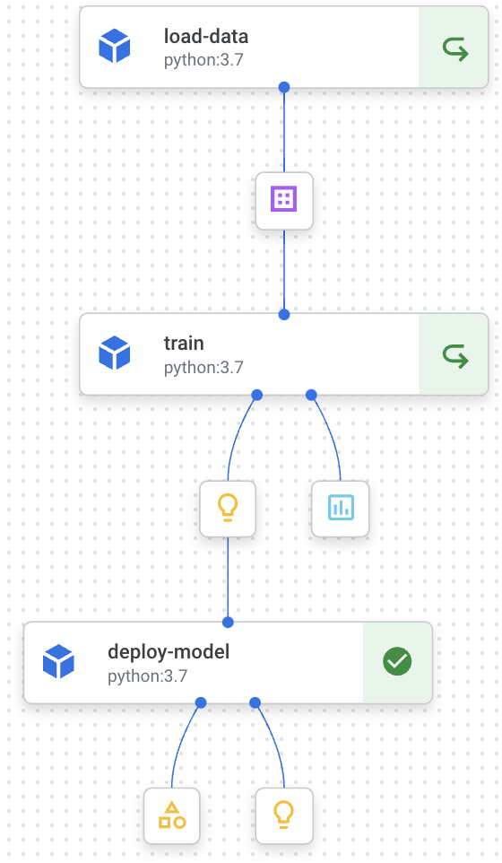

# kfp-v2

Follow up https://www.kubeflow.org/docs/components/pipelines/sdk/v2

#### Install 

```bash
pip install kfp --upgrade
```


### Add Task

Calculates sum of two arguments

**Inputs**

| Name | Type  | Default | Description   |
| ---- | ----- | ------- | ------------- |
| a    | float | 1       | first number  |
| b    | float | 7       | second number |

**Output**

| Name | Type  | Default | Description          |
| ---- | ----- | ------- | -------------------- |
|      | float | 8       | sum of two arguments |



**Usage:**

```bash
python add_pipeline/pipeline.py
```


### MNIST 

> Goal: Implements a perfect mnist pipeline

**Click Image for show implement notebook ⬇️**

[](mnist/mnist_train/mnist_pipeline.ipynb) 

1. Load Data Component ✅
2. Proc Data Component ✅
3. Train CNN Component ✅
4. Train Linear Component ✅
5. Evaluate Component ✅
6. Train Metrics ❌
7. Model Deploy ❌


**Click Image for show implement notebook ⬇️**

[](mnist/mnist_deploy/mnist_deploy.ipynb)

1. Load Data Component ✅
2. Train Linear Component ✅
3. Deploy Model Component ✅
